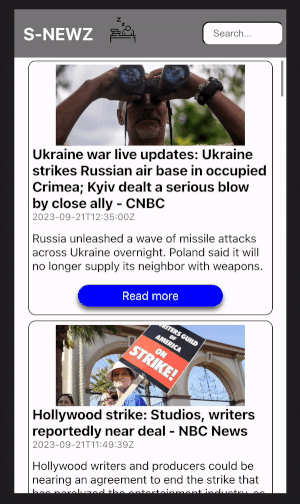

# S-NEWZ

## Abstract
S-NEWZ is a news aggregator webapp that allows the user to view the top headlines of the day, as well as search for specific topics of interest.  This application was built using React and SCSS with a mobile-first design and all data is being served via the [News API](https://newsapi.org/). This project served as the final take-home project prior to graduation from the Turing School of Software and Design, intending to simulate a take home challenge a company would provide during an interview process.

## Preview of App
### Mobile display

### Desktop display

## Planning process
- I used Github Projects to ticket out all steps toward MVP.
- I used Excalidraw to create mocks of how I wanted the experience to look

## Component Tree

In the project directory, to you can run:
### `npm start`
to run the app in the development mode.\
Open [http://localhost:3000](http://localhost:3000) to view it in your browser.

The page will reload when you make changes.\
You may also see any lint errors in the console.

This project was bootstrapped with [Create React App](https://github.com/facebook/create-react-app).
